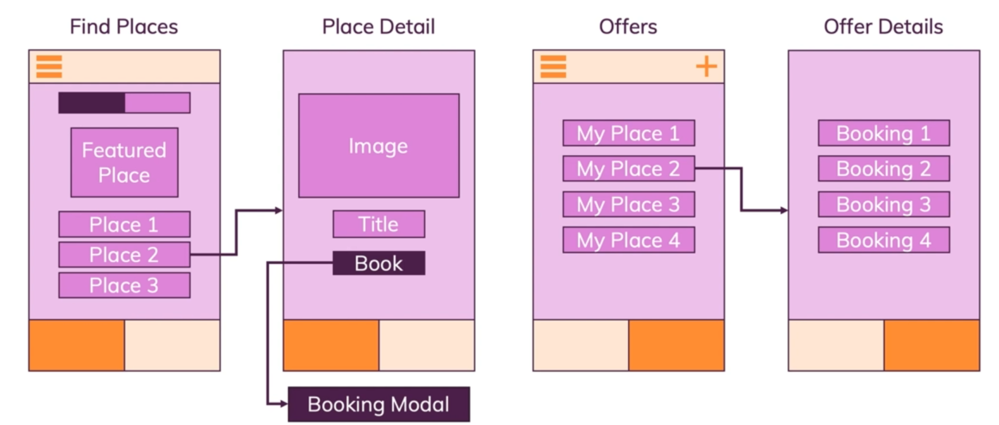
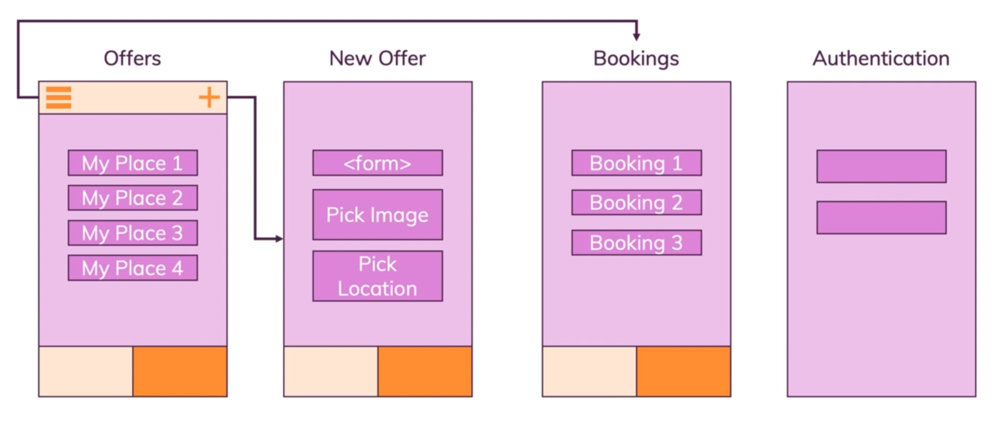
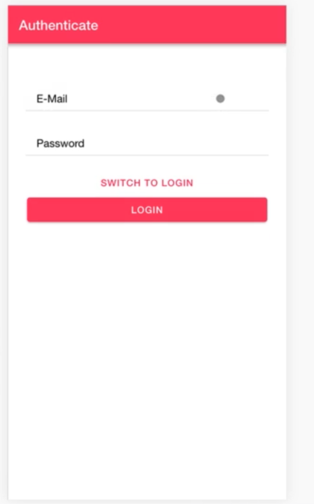
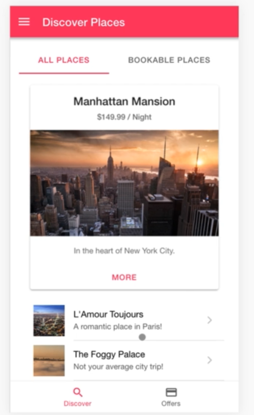

# casabnb

It is cross platform app(IOS, Android and Progressive Web App) that let's you book place or offer you place to be booked.

The project composes:

- Booking page to choose a place to book
- Places page to put your place to be booked
- Offer page
- Authentication

Technologies used are: Angular framework and Ionic framework for the front end, I used capacitor for the mobile development and Electron.js for the desktop developement, the backend was done using Firebase

### Planning for the project

### Authentication page

<!--  -->

### Discover places page

### Offers Page

### Edit offers Page

